# Panduan Aplikasi SimpleAkunting V4

Panduan lengkap untuk penggunaan aplikasi SimpleAkunting V4 - Sistem Akuntansi Modern untuk UMKM, Koperasi, dan BUMDesa.

---

## Daftar Isi

1. [Pendahuluan](#1-pendahuluan)
2. [Memulai](#2-memulai)
3. [Master Data](#3-master-data)
4. [Transaksi](#4-transaksi)
5. [Aset Biologis - PSAK 69](#5-aset-biologis---psak-69)
6. [Manufaktur](#6-manufaktur)
7. [Anggaran](#7-anggaran)
8. [Laporan Keuangan](#8-laporan-keuangan)
9. [Pengaturan & Administrasi](#9-pengaturan--administrasi)

---

## 1. Pendahuluan

### 1.1 Tentang SimpleAkunting V4

SimpleAkunting V4 adalah aplikasi akuntansi modern berbasis web yang dirancang khusus untuk:
- **UMKM** (Usaha Mikro, Kecil, dan Menengah)
- **Koperasi**
- **BUMDesa** (Badan Usaha Milik Desa)
- **Yayasan**

### 1.2 Standar Akuntansi yang Didukung

| Standar | Keterangan |
|---------|------------|
| SAK ETAP | Standar Akuntansi Keuangan untuk Entitas Tanpa Akuntabilitas Publik |
| SAK Entitas Privat | Standar untuk entitas privat |
| PSAK | Pernyataan Standar Akuntansi Keuangan |
| **PSAK 69** | Khusus untuk Aset Biologis (pertanian, peternakan, dll.) |
| **Kepmendesa 136/2022** | Keputusan Menteri Desa No. 136 Tahun 2022 - Pelaporan Akuntansi Keuangan khusus BUMDesa |

### 1.3 Fitur Utama

- ✅ Multi-entitas dan multi-user
- ✅ Chart of Accounts fleksibel
- ✅ Transaksi penjualan & pembelian
- ✅ Kas & bank management
- ✅ Aset tetap dengan depresiasi
- ✅ **Aset Biologis (PSAK 69)** - penilaian nilai wajar
- ✅ **Manufacturing** - BOM & production orders
- ✅ Laporan keuangan lengkap
- ✅ Export PDF & Excel
- ✅ Audit trail

---

## 2. Memulai

### 2.1 Dashboard

Setelah login, Anda akan melihat Dashboard yang menampilkan ringkasan keuangan perusahaan.

**Informasi yang ditampilkan:**
- Total Pendapatan periode berjalan
- Total Beban
- Laba/Rugi Bersih
- Saldo Kas
- Statistik pelanggan, supplier, dan invoice tertunda
- Transaksi penjualan & pembelian terbaru

### 2.2 Setup Wizard

Untuk perusahaan baru, gunakan Setup Wizard untuk:
1. Mengisi informasi perusahaan
2. Memilih jenis entitas (UMKM, Koperasi, BUMDesa, Yayasan)
3. Memilih standar akuntansi
4. Inisialisasi Chart of Accounts standar

---

## 3. Master Data

### 3.1 Chart of Accounts (Bagan Akun)

Menu: **Master Data → Bagan Akun**

#### Fitur:
- Menampilkan struktur akun hierarkis
- Filter berdasarkan tipe (Asset, Liability, Equity, Revenue, Expense)
- Tambah akun baru dengan modal
- Edit akun yang sudah ada

#### Import dari Excel

**Cara Import:**
1. Klik tombol **Import** di halaman Chart of Accounts
2. Download template Excel dengan klik **Download Template**
3. Isi data sesuai format template

**Format Template COA:**

| Kolom | Wajib | Keterangan |
|-------|-------|------------|
| `code` | Ya | Kode akun (contoh: 1100, 2100) |
| `name` | Ya | Nama akun |
| `type` | Ya | Tipe: Asset, Liability, Equity, Revenue, Expense |
| `normal_balance` | Ya | DEBIT atau CREDIT |
| `report_type` | Ya | NERACA atau LABARUGI |
| `is_parent` | Tidak | true/false (default: false) |
| `parent_code` | Tidak | Kode parent jika sub-akun |

**Validasi:**
- Kode akun harus unik
- Tipe harus sesuai dengan pilihan yang tersedia
- Normal balance harus DEBIT atau CREDIT

---

### 3.2 Kontak (Pelanggan & Supplier)

Menu: **Master Data → Kontak**

#### Fitur:
- Daftar semua pelanggan dan supplier
- Filter berdasarkan tipe
- Detail kontak dengan saldo piutang/hutang

#### Import dari Excel

**Cara Import:**
1. Klik **Import** di halaman Kontak
2. Download template Excel
3. Isi data kontak

**Format Template Kontak:**

| Kolom | Wajib | Keterangan |
|-------|-------|------------|
| `name` | Ya | Nama kontak |
| `type` | Ya | Customer, Supplier, atau Both |
| `email` | Tidak | Alamat email |
| `phone` | Tidak | Nomor telepon |
| `address` | Tidak | Alamat lengkap |
| `npwp` | Tidak | Nomor NPWP |

---

### 3.3 Persediaan (Inventory)

Menu: **Master Data → Persediaan**

#### Fitur:
- Daftar semua barang persediaan
- Real-time stock tracking
- Peringatan stok rendah
- Nilai total persediaan
- **Fitur pencarian** untuk filter barang

#### Import dari Excel

**Cara Import:**
1. Klik **Import** di halaman Persediaan
2. Download template Excel
3. Isi data barang

**Format Template Inventory:**

| Kolom | Wajib | Keterangan |
|-------|-------|------------|
| `code` | Ya | Kode barang (unik) |
| `name` | Ya | Nama barang |
| `unit` | Ya | Satuan (pcs, kg, liter, dll.) |
| `cost` | Ya | Harga beli (angka, tanpa Rp) |
| `price` | Ya | Harga jual (angka, tanpa Rp) |
| `stock` | Ya | Stok awal (angka) |
| `min_stock` | Tidak | Stok minimum (default: 0) |

**Tips:**
- Gunakan angka tanpa format ribuan
- Contoh benar: `50000` bukan `50.000`

---

### 3.4 Aset Tetap

Menu: **Master Data → Aset Tetap**

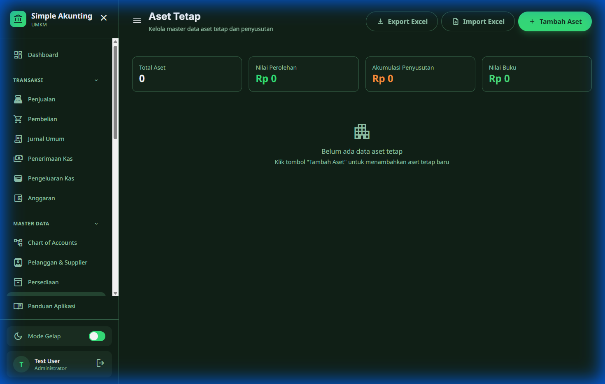

#### Fitur:
- Kelola aset tetap perusahaan
- Tracking nilai buku
- Perhitungan penyusutan
- Import massal dari Excel

---

## 4. Transaksi

### 4.1 Penjualan

Menu: **Transaksi → Penjualan**

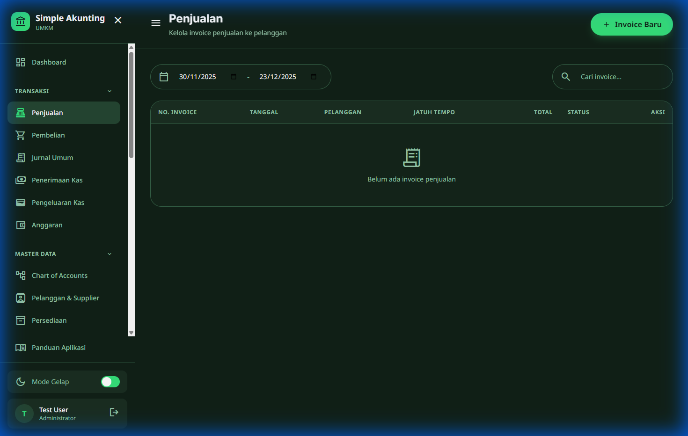

**Daftar Penjualan** menampilkan:
- Nomor invoice
- Tanggal
- Pelanggan
- Total
- Status pembayaran

#### Buat Penjualan Baru

**Langkah:**
1. Pilih pelanggan
2. Tentukan tanggal dan jatuh tempo
3. Tambah item barang/jasa
4. Simpan

---

### 4.2 Pembelian

Menu: **Transaksi → Pembelian**

#### Buat Pembelian Baru

**Langkah:**
1. Pilih supplier
2. Tentukan tanggal
3. Tambah item yang dibeli
4. Simpan

---

### 4.3 Penerimaan Kas

Menu: **Transaksi → Penerimaan Kas**

**Gunakan untuk:**
- Terima pembayaran dari pelanggan
- Penerimaan pendapatan lain
- Setoran modal

---

### 4.4 Pengeluaran Kas

Menu: **Transaksi → Pengeluaran Kas**

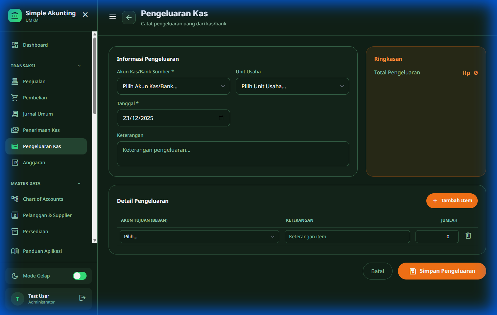

**Gunakan untuk:**
- Bayar ke supplier
- Biaya operasional
- Pengeluaran lainnya

---

### 4.5 Jurnal Umum

Menu: **Transaksi → Jurnal Umum**

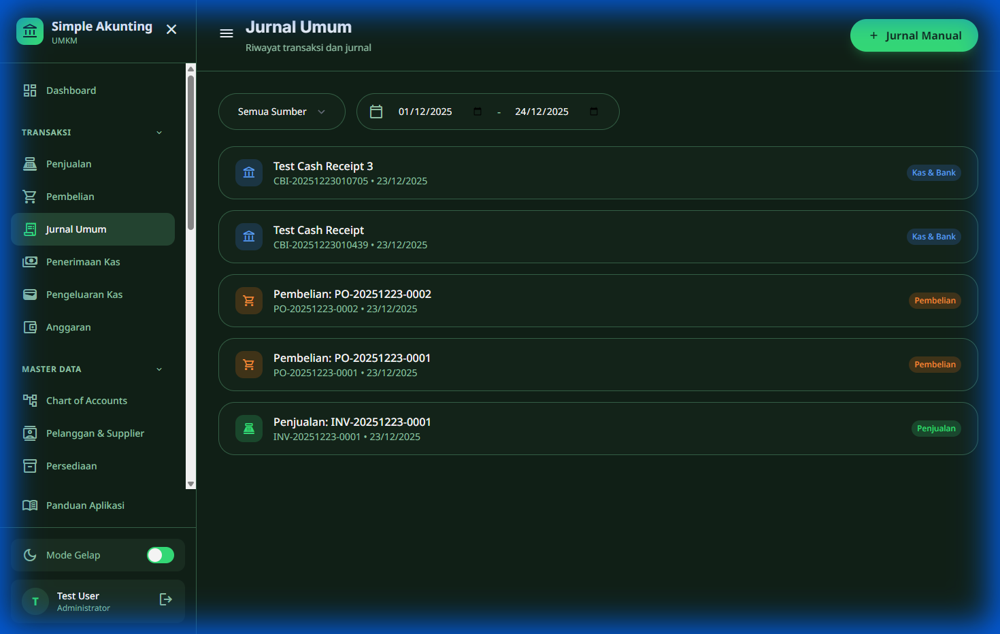

**Semua transaksi** otomatis menghasilkan jurnal:
- Sales → Jurnal penjualan
- Purchase → Jurnal pembelian
- Cash → Jurnal kas

#### Jurnal Manual

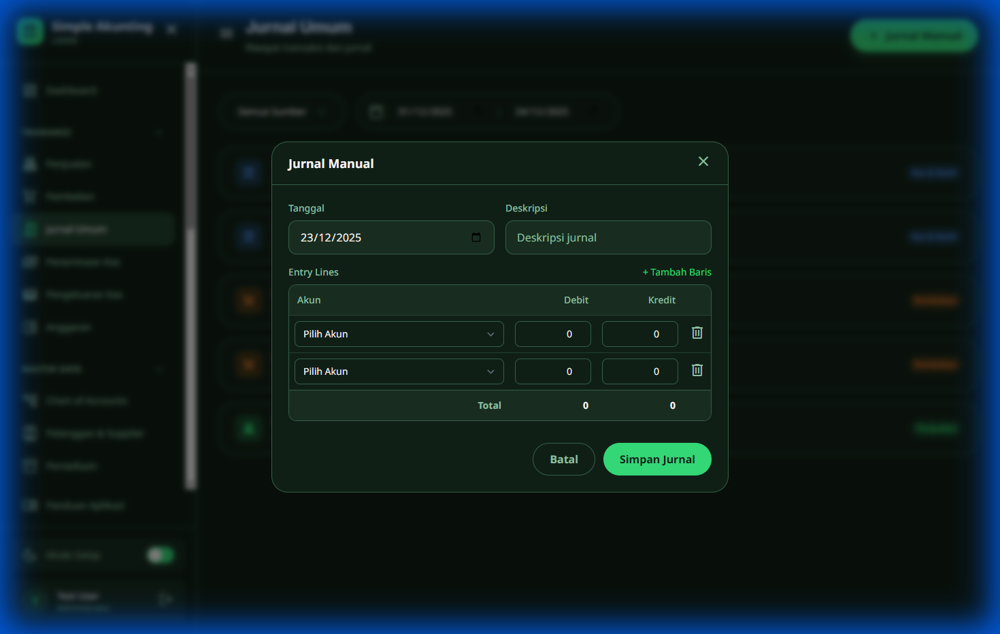

**Gunakan untuk:**
- Jurnal penyesuaian
- Koreksi kesalahan
- Transaksi khusus

---

## 5. Aset Biologis - PSAK 69

> **Catatan:** Fitur ini harus diaktifkan di **Pengaturan Perusahaan**

### 5.1 Mengaktifkan PSAK 69

1. Buka **Pengaturan → Pengaturan Perusahaan**
2. Centang **Aktifkan PSAK 69 (Aset Biologis)**
3. Klik **Simpan**

### 5.2 Daftar Aset Biologis

Menu: **Master Data → Aset Biologis**

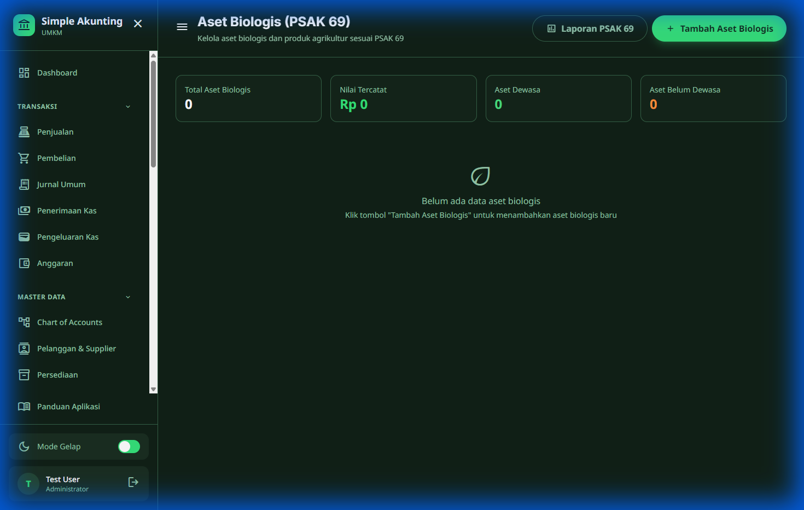

#### Kategori Aset Biologis:
- **Tanaman Produktif** - Kelapa sawit, karet, teh, dll.
- **Tanaman Semusim** - Padi, jagung, sayuran
- **Hewan Ternak** - Sapi, kambing, ayam
- **Hewan Produksi** - Sapi perah, ayam petelur

### 5.3 Fitur Utama

| Fitur | Keterangan |
|-------|------------|
| **Valuasi** | Penilaian nilai wajar (fair value) |
| **Transformasi** | Perubahan biologis (pertumbuhan, penuaan) |
| **Panen** | Catat hasil panen masuk ke persediaan |

### 5.4 Laporan PSAK 69

**Laporan yang tersedia:**
- **Rekonsiliasi** - Pergerakan aset biologis
- **Perubahan Nilai Wajar** - Laba/rugi dari penilaian ulang
- **Produksi** - Hasil panen per periode
- **Disclosure** - Pengungkapan untuk laporan keuangan

---

## 6. Manufaktur

### 6.1 Assembly / Bill of Materials (BOM)

Menu: **Manufaktur → Assembly**

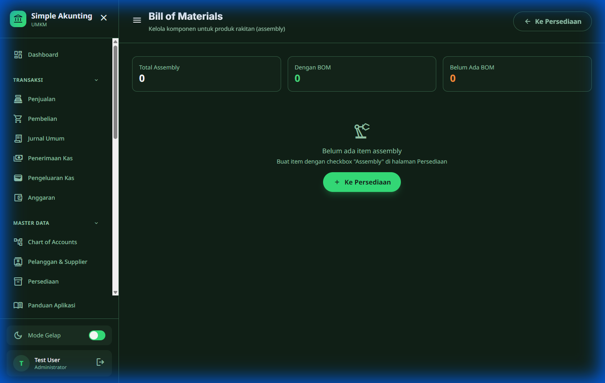

**BOM** mendefinisikan:
- Produk jadi yang dihasilkan
- Komponen/bahan baku yang dibutuhkan
- Kuantitas setiap komponen
- Biaya produksi

### 6.2 Production Order

Menu: **Manufaktur → Produksi**

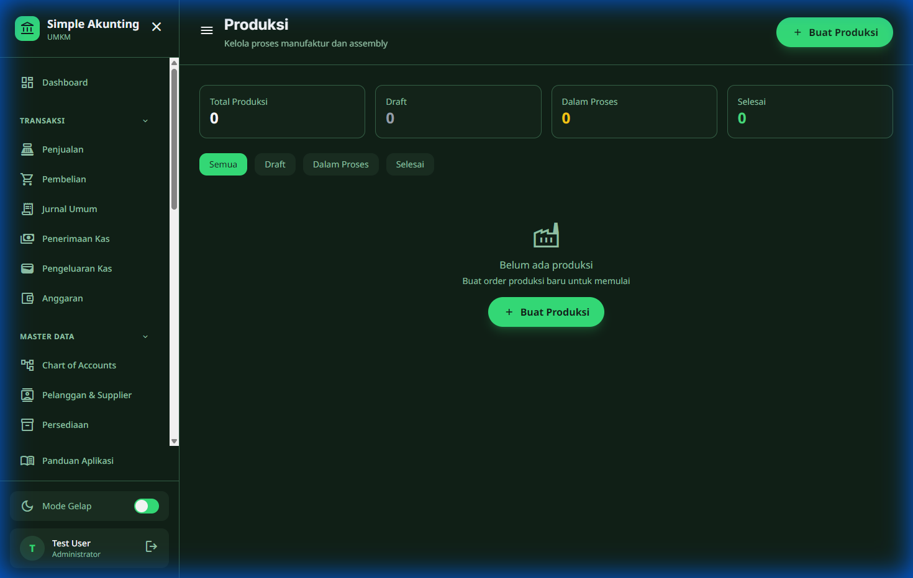

#### Buat Production Order

**Langkah:**
1. Pilih produk (dari BOM)
2. Tentukan kuantitas yang akan diproduksi
3. Sistem menghitung bahan baku yang dibutuhkan
4. Simpan

### 6.3 Proses Produksi

| Status | Aksi | Keterangan |
|--------|------|------------|
| **Draft** | Start | Mulai produksi (bahan baku dikurangi) |
| **In Progress** | Complete | Selesai produksi (produk jadi masuk stok) |
| **In Progress** | Cancel | Batalkan (bahan baku dikembalikan) |
| **Completed** | - | Produksi selesai |

### 6.4 Laporan Manufaktur

**Laporan tersedia:**
- Biaya Produksi per periode
- Penggunaan Material
- Work In Progress (WIP)

---

## 7. Anggaran

Menu: **Transaksi → Anggaran**

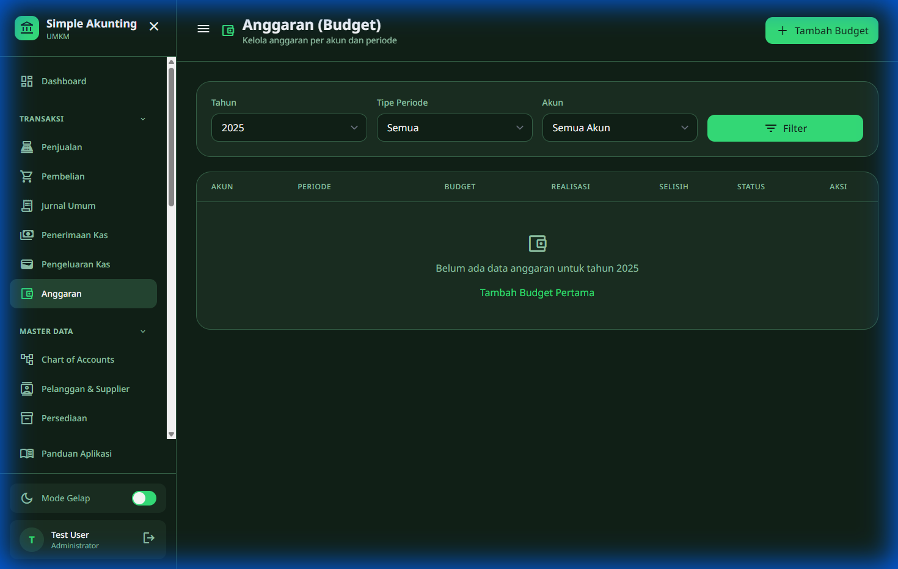

### 7.1 Fitur Anggaran

- Buat anggaran per akun per periode
- Bandingkan anggaran vs aktual
- Analisis varian

### 7.2 Membuat Anggaran

1. Klik **Tambah Anggaran**
2. Pilih akun (biasanya beban/pendapatan)
3. Tentukan periode (bulan/tahun)
4. Masukkan nilai anggaran
5. Simpan

---

## 8. Laporan Keuangan

### 8.1 Neraca (Balance Sheet)

Menu: **Laporan → Neraca**

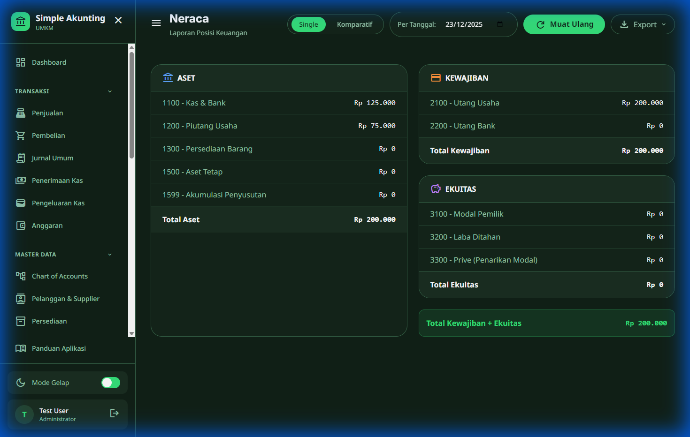

**Menampilkan:**
- Total Aset
- Total Kewajiban
- Total Ekuitas
- Perbandingan periode (opsional)

### 8.2 Laba Rugi (Profit & Loss)

Menu: **Laporan → Laba Rugi**

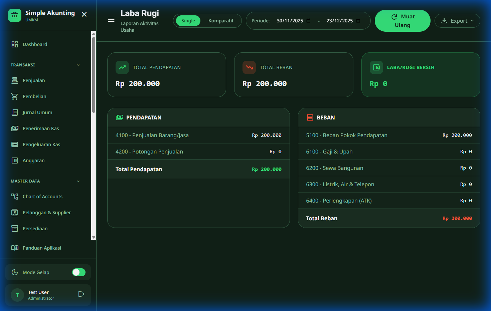

**Menampilkan:**
- Total Pendapatan
- Total Beban
- Laba/Rugi Bersih

### 8.3 Arus Kas (Cash Flow)

Menu: **Laporan → Arus Kas**

**Menampilkan:**
- Arus kas dari aktivitas operasi
- Arus kas dari aktivitas investasi
- Arus kas dari aktivitas pendanaan

### 8.4 Laporan Lainnya

| Laporan | Keterangan |
|---------|------------|
| **Neraca Saldo** | Trial Balance semua akun |
| **Buku Besar** | Ledger per akun |
| **Perubahan Ekuitas** | Mutasi modal |
| **Daftar Jurnal** | Semua transaksi jurnal |
| **Analisis Keuangan** | Rasio-rasio keuangan |

---

## 9. Pengaturan & Administrasi

### 9.1 Manajemen Pengguna

Menu: **Pengaturan → Pengguna**

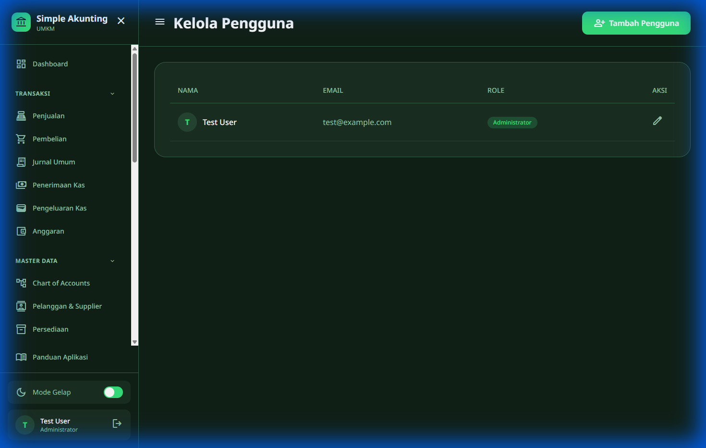

**Peran yang tersedia:**
- **Administrator** - Akses penuh
- **Accountant** - Akses transaksi & laporan
- **Viewer** - Hanya lihat data

### 9.2 Audit Trail

Menu: **Pengaturan → Audit Log**

**Mencatat:**
- Setiap perubahan data
- Siapa yang melakukan
- Kapan dilakukan
- Nilai sebelum & sesudah

---

## Bantuan

Jika mengalami kendala, silakan hubungi:
- **Email:** support@simpleakunting.com
- **Website:** https://simpleakunting.biz.id

---

*Dokumentasi ini dibuat untuk SimpleAkunting V4*  
*Terakhir diperbarui: Desember 2024*
